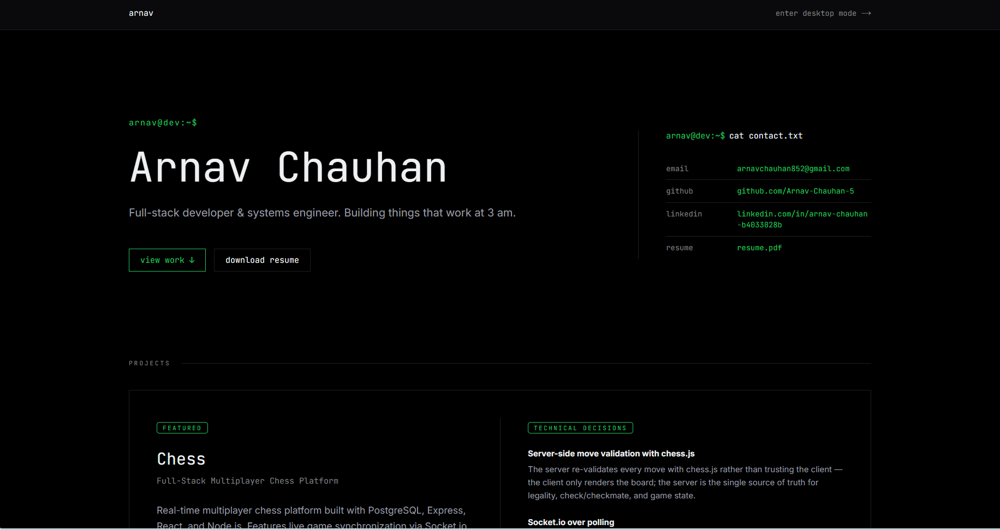
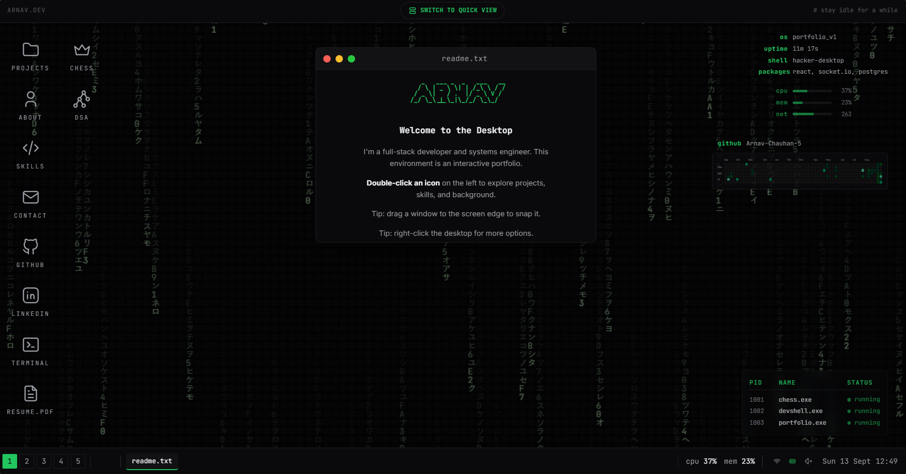

# 💻 Portfolio

> Full-stack developer & systems engineer. Building things that work at 3 am.


[](https://portfolio-iota-six-fgvpeok9jf.vercel.app/)

## Overview

This project is a comprehensive, interactive developer portfolio featuring a unique dual-view design. It allows visitors to seamlessly toggle between a clean, scrollable "quick view" for fast reading, and a fully interactive, terminal-inspired desktop OS environment. The desktop mode features draggable windows, a functional taskbar, and live API integrations (like GitHub contributions and DSA statistics), providing an immersive experience that reflects a passion for system engineering and detail-oriented frontend design.




## 🌐 Live Demo
[https://portfolio-iota-six-fgvpeok9jf.vercel.app/](https://portfolio-iota-six-fgvpeok9jf.vercel.app/)

## Features

- **Dual-View Design**: Toggle between a plain scrollable "quick view" and a fully interactive fake-desktop OS mode.
- **Desktop Mode**: Experience a full OS environment featuring draggable windows, a functional taskbar, app icons, and window snapping.
- **Projects Window**: In-depth write-ups per project covering the Problem, Role, and Technical Decisions.
- **Live Stats Integrations**:
  - Live GitHub contribution graph.
  - Data Structures & Algorithms (DSA) stats with linked competitive-programming profiles.
- **Immersive Experience**: Boot-up intro sequence and an idle screensaver.

## Tech Stack

- **Next.js (App Router)**
- **JavaScript**
- **Tailwind CSS v4**
- **Framer Motion**

## Getting Started

Follow these steps to set up the project locally:

```bash
git clone <repo-url>
cd portfolio
npm install
npm run dev
```

*Note: There are no required environment variables for local development.*

## Featured Projects

The portfolio features the following major projects, which reside in their own standalone repositories:

- **[Chess](https://github.com/Arnav-Chauhan-5/Chess)**
- **[C++20 Interactive Developer Shell](https://github.com/Arnav-Chauhan-5/Developer-shell)**

## Contact

- **Email**: [arnavchauhan852@gmail.com](mailto:arnavchauhan852@gmail.com)
- **GitHub**: [@Arnav-Chauhan-5](https://github.com/Arnav-Chauhan-5)
- **LinkedIn**: [Arnav Chauhan](https://www.linkedin.com/in/arnav-chauhan-b4033028b)
